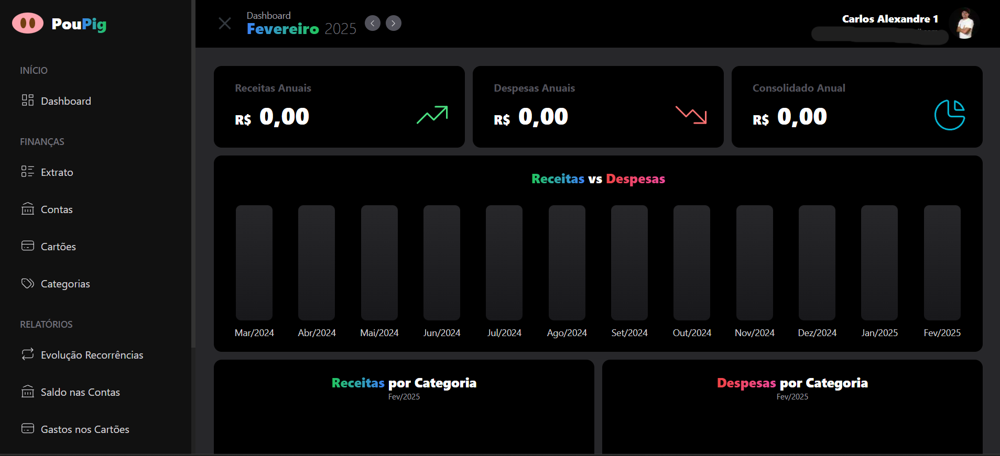

# poupig

Poupig é uma aplicação fullstack para gerenciamento de dados financeiros, desenvolvida com Next.js no frontend, NestJS no backend, Prisma para ORM e PostgreSQL como banco de dados.

# Poupig




## O que é este projeto?

Poupig é uma aplicação fullstack que exibe dados financeiros de forma intuitiva, permitindo o monitoramento de receitas, despesas e lucro em tempo real.

## 🖥️ Como rodar o projeto?

### Requisitos

- Node.js instalado
- PostgreSQL configurado
- Docker (opcional para ambiente conteinerizado)

### Passos para executar

#### Backend (NestJS)

1. Clone o repositório:
   ```sh
   git clone https://github.com/seu-repositorio/dashboard-financas.git
   ```
2. Acesse o diretório do backend:
   ```sh
   cd dashboard-financas/backend
   ```
3. Instale as dependências:
   ```sh
   npm install
   ```
4. Configure as variáveis de ambiente (crie um arquivo `.env` baseado no `.env.example`).
5. Execute as migrações do banco de dados (Prisma):
   ```sh
   npx prisma migrate dev --name init
   ```
6. Inicie o servidor:
   ```sh
   npm run start:dev
   ```

#### Frontend (Next.js)

1. Acesse o diretório do frontend:
   ```sh
   cd dashboard-financas/frontend
   ```
2. Instale as dependências:
   ```sh
   npm install
   ```
3. Inicie a aplicação:
   ```sh
   npm run dev
   ```
4. Acesse a aplicação em [http://localhost:3000](http://localhost:3000).

## 💻 Tecnologias Utilizadas

<div style="display: grid; grid-template-columns: repeat(auto-fit, minmax(80px, 1fr)); gap: 10px; align-items: center;">
  
  
  
  
  
  
</div>

## ⚙️ Features do Projeto

- Visualização de receitas, despesas e lucro
- Interface intuitiva e responsiva para monitoramento financeiro
- Exibição de dados financeiros em tempo real

## 🔗 Links Úteis

- [Documentação do Next.js](https://nextjs.org/docs)
- [Documentação do NestJS](https://docs.nestjs.com/)
- [Documentação do Prisma](https://www.prisma.io/docs)
- [Documentação do PostgreSQL](https://www.postgresql.org/docs/)
